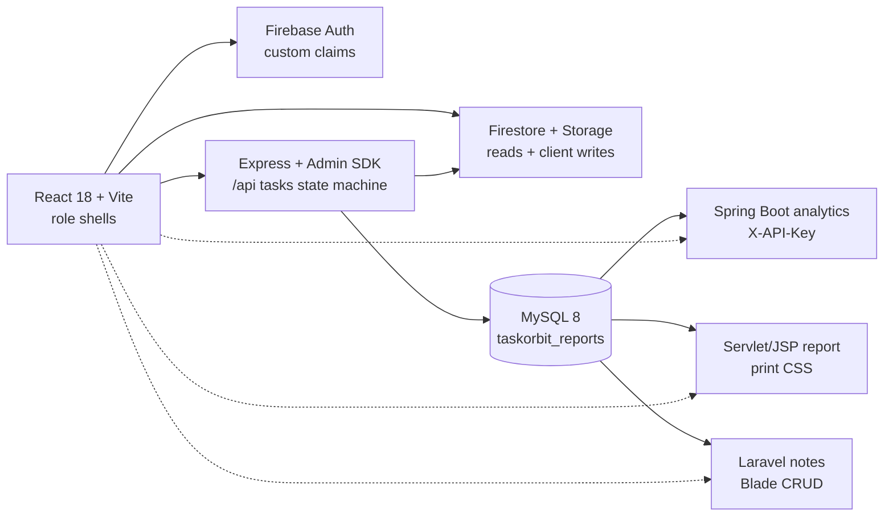

# Architecture

```mermaid
flowchart LR
    FE[React 18 + Vite<br/>role shells] --> FB[Firebase Auth<br/>custom claims]
    FE --> FS[Firestore + Storage<br/>reads + client writes]
    FE --> EX[Express + Admin SDK<br/>/api tasks state machine]
    EX --> FS
    EX --> MY[(MySQL 8<br/>taskorbit_reports)]
    MY --> SB[Spring Boot analytics<br/>X-API-Key]
    MY --> JSP[Servlet/JSP report<br/>print CSS]
    MY --> LV[Laravel notes<br/>Blade CRUD]
    FE -.-> SB
    FE -.-> JSP
    FE -.-> LV
```
