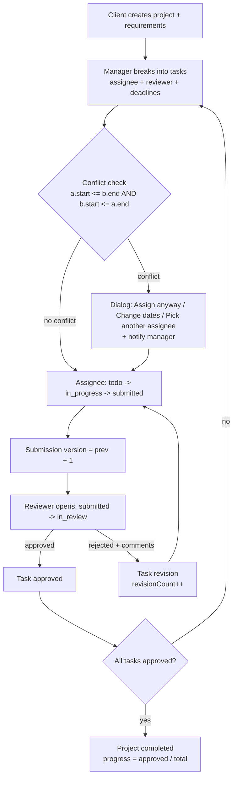

# TaskOrbit workflow

```mermaid
flowchart TD
    C[Client creates project + requirements] --> M[Manager breaks into tasks<br/>assignee + reviewer + deadlines]
    M --> CC{Conflict check<br/>a.start <= b.end AND b.start <= a.end}
    CC -- conflict --> D[Dialog: Assign anyway / Change dates / Pick another assignee<br/>+ notify manager]
    CC -- no conflict --> A
    D --> A[Assignee: todo -> in_progress -> submitted]
    A --> S[Submission version = prev + 1]
    S --> R[Reviewer opens: submitted -> in_review]
    R -->|approved| AP[Task approved]
    R -->|rejected + comments| RV[Task revision<br/>revisionCount++]
    RV --> A
    AP --> ALL{All tasks approved?}
    ALL -- no --> M
    ALL -- yes --> P[Project completed<br/>progress = approved / total]
```
